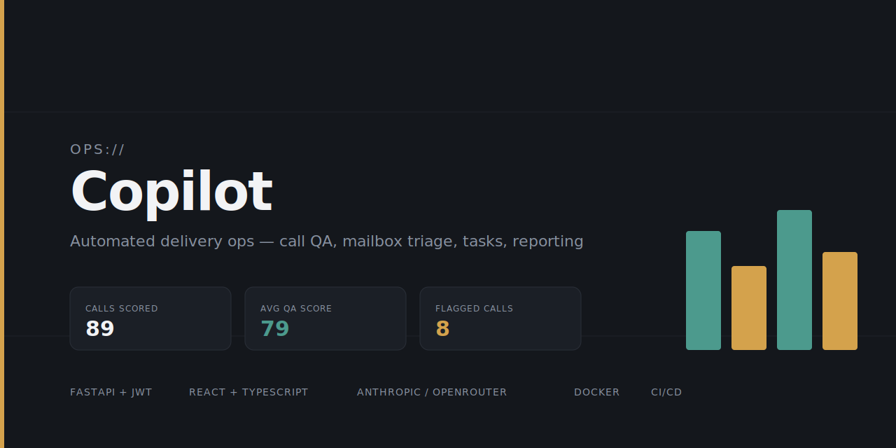

<p align="center">
  
</p>

<p align="center">
  <a href="https://github.com/adcristin/ops-copilot/actions/workflows/ci.yml">
    
  </a>
  <a href="LICENSE">
    
  </a>
  
  
  <a href="https://github.com/adcristin/ops-copilot/commits/main">
    
  </a>
</p>

# Ops Copilot

An automated delivery-operations toolkit: call quality auto-scoring, mailbox
triage, task tracking, and scheduled reporting — the software equivalent of
an "Operations Executive – Delivery Operations" role, backed by a real
async job pipeline, JWT auth, and a CI-tested API.

## 🚀 Core Capabilities

| Module | What it does | Status |
|---|---|---|
| `backend/call_qa/` | Whisper transcription + LLM rubric scoring of call transcripts | Working |
| `backend/mailbox_ops/` | Classifies incoming emails, drafts replies, sets SLA/priority | Working |
| `backend/tasks/` | Auto-creates tasks from QA flags and mailbox escalations | Working |
| `backend/reporting/` | Generates Excel + PPT summary reports from live DB data | Working |
| `backend/core/security.py` | JWT-based authentication and RBAC (Role-Based Access Control) | Working |
| `backend/tasks/service.py` | Async background task orchestration for high-latency AI work | Working |
| `.github/workflows/` | Automated CI pipeline (pytest) for stability and regression checks | Working |
| `backend/main.py` | FastAPI app wiring all of the above (20+ routes) | Working |
| `frontend/` | React + TypeScript dashboard (QA overview, mailbox inbox, task kanban) | Working |

The frontend attempts to fetch live data from the backend on load; if the
backend isn't running, it falls back to demo data automatically (look for
the "● live data" / "○ demo data" badge on each page).

## 🛠 Tech Stack

- **Backend**: Python, FastAPI, SQLAlchemy (SQLite), Whisper (local), Anthropic SDK or OpenAI SDK
- **Security**: JWT (python-jose), password hashing (passlib/bcrypt)
- **Frontend**: React 18, TypeScript, Vite, Recharts, lucide-react
- **CI/CD**: GitHub Actions, pytest, httpx
- **Infrastructure**: Docker, Docker Compose

## ⚙️ Setup

### 🐳 Quick start (recommended)
The fastest way to get the entire system running is using Docker.

1. **Environment**: create a `.env` file in the `backend/` folder with your API keys (see below).
2. **Launch**:
   ```bash
   docker-compose up --build
   ```
3. **Access**:
   - Frontend: `http://localhost:5173`
   - API Docs: `http://localhost:8000/docs`

---

### 💻 Manual setup (for development)

#### Backend
```bash
cd backend
pip install -r requirements.txt
cp .env.example .env   # then fill in your key(s)
# Optional: seed the DB with realistic data
python -m scripts.seed_call_qa --limit 20 --score
uvicorn main:app --reload --port 8000
```
Visit `http://localhost:8000/docs` for interactive API docs (Swagger).

**Environment variables** (`.env`):
- `LLM_PROVIDER`: `anthropic` or `openrouter`
- `ANTHROPIC_API_KEY` or `OPENROUTER_API_KEY`: your provider key
- `CORS_ALLOWED_ORIGINS`: comma-separated list of allowed origins (e.g. `http://localhost:5173`) — defaults to `*`

#### Frontend
```bash
cd frontend
npm install
npm run dev
```
Open `http://localhost:5173`. Set `VITE_API_BASE` in a `.env` file if your
backend isn't on `localhost:8000`.

## 🔄 Async AI workflow (submit-poll pattern)
Because transcription and LLM scoring are high-latency operations, the API uses an asynchronous pattern to prevent server timeouts:

1. **Submit**: call `/calls/score`, `/calls/transcribe-and-score`, or `/mailbox`
2. **Acknowledge**: the server returns `202 Accepted` immediately with a `task_id`
3. **Poll**: the client polls `GET /tasks/background/{task_id}` to track status (`pending` → `processing` → `completed`)
4. **Retrieve**: once `completed`, the final result is returned in the response

## 🔐 Authentication
The API is secured with JWT tokens.
- **Login**: `POST /auth/token` (OAuth2 password flow) to receive a token
- **Access**: include the token in the header: `Authorization: Bearer <token>`
- **Protected routes**: agent management, reporting, and task closing require authentication

## 🧪 Testing & CI
- **Run tests locally**: `cd backend && pytest tests/`
- **CI**: every push to `main` triggers a GitHub Action that installs dependencies and runs the test suite

## 🌟 What's next
- **Scheduled reporting**: cron/APScheduler calling the reporting endpoints daily/weekly
- **Production deployment**: backend to Render/Railway, frontend to Vercel, Postgres instead of SQLite
- **Celery migration**: moving from `FastAPI.background_tasks` to a dedicated Celery + Redis worker pool for higher concurrency

## License
MIT — see [LICENSE](LICENSE).
